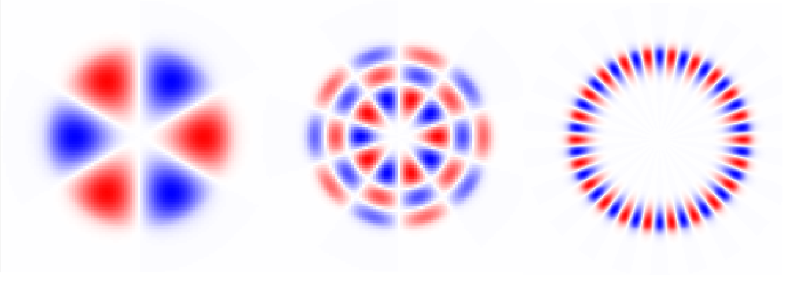

.. lpmodes documentation master file

lpmodes
====================================

The lpmodes package is a python toolkit designed for the analysis, simulation, 
and manipulation of linearly polarized (LP) modes in step index optical fibers. 

Functions are provided to determine the allowed modes, compute their properties, 
and simulate coupling and propagation of beams.

A GUI, lpmodes_gui, allows modes to be solved, visualised and exported.

^^^^^^^^
Contents
^^^^^^^^

.. toctree::
   :maxdepth: 2
   
   installation
   getting_started
   plotting_coupling
   fibre_properties
   using_the_gui
   function_reference
   mode
   solution
   contributing
   

* :ref:`genindex`
